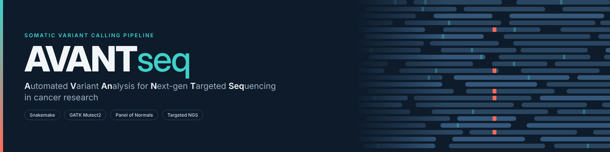
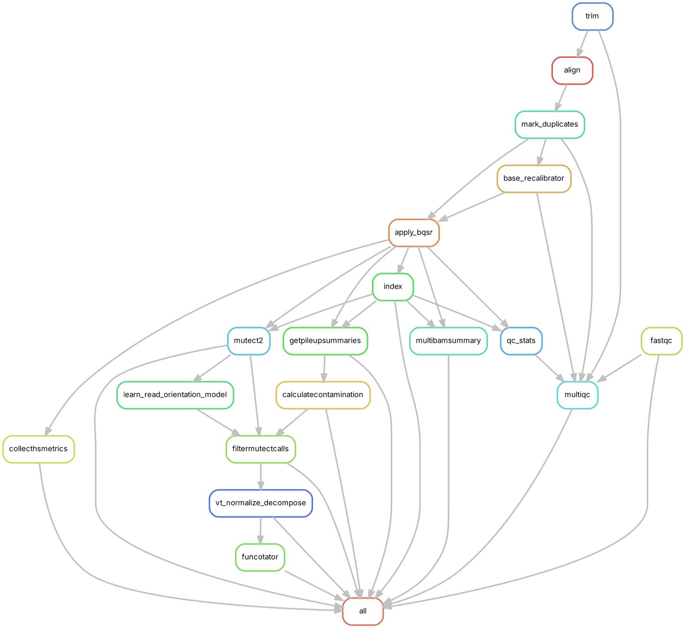

# AVANTseq: Automated Variant Analysis for Next-gen Targeted Sequencing in Cancer research

[](https://doi.org/10.5281/zenodo.23212970)  

**AVANTseq** is a modular, Snakemake-based workflow for high-confidence somatic variant calling from paired-end targeted NGS data, following the GATK best practices for somatic short variant discovery (tumor-only mode). It includes:

- A pipeline for generating a custom **Panel of Normals (PoN)**
- A downstream **variant calling pipeline** using GATK Mutect2 with the generated PoN

## Workflow overview


<details>
<summary>Show the full Snakemake rule graphs</summary>

**AVANTseq.smk**  


**CreatePoN.smk**  

</details>

---

## Overview

This repository contains two main Snakemake workflows:

1. **PoN Pipeline** – Generates a custom Panel of Normals from a set of normal samples.
2. **AVANTseq Pipeline** – Uses Mutect2 to call somatic variants in tumor samples (tumor-only mode), leveraging the merged custom + public PoN.

Run the PoN pipeline first: its output (`merged_pon`) is an input of the AVANTseq pipeline.

Both workflows are modular, configurable via YAML, and built for reproducibility and scalability.

---

## 📁 Repository Structure

```plaintext
AVANTseq/
├── rules/
│   ├── trim.smk                # Trim adapters and low-quality bases with fastp
│   ├── align.smk               # Align with bwa mem, mark duplicates and recalibrate base qualities (BQSR)
│   ├── qc.smk                  # Check sequencing and alignment quality
│   ├── pon.smk                 # Generate a custom PoN and merge with an existing one
│   ├── variants.smk            # Call, filter and annotate somatic variants (Mutect2, orientation bias, Funcotator)
├── config/
│   ├── config.yaml             # Configuration file containing the paths for required files (shared by both pipelines)
│   ├── samples_normal.yaml     # Normal samples list (used by CreatePoN.smk)
│   ├── samples_tumor.yaml      # Tumor samples list (used by AVANTseq.smk)
├── docs/                       # Detailed documentation and rule graphs for each pipeline
├── CreatePoN.smk               # Top-level Snakefile to create custom PoN from normal samples
├── AVANTseq.smk                # Top-level Snakefile to call somatic variants from tumor samples using the PoN previously generated
├── CITATION.cff                # Citation metadata
├── LICENSE.txt                 # MIT license file
└── README.md                   # This file
```

## 🔧 Requirements

To run this pipeline, the following tools must be installed and available in your `PATH`:

- [BWA](http://bio-bwa.sourceforge.net/) – read alignment  
- [deepTools](https://deeptools.readthedocs.io/) – coverage summary (multiBamSummary)  
- [FastQC](https://www.bioinformatics.babraham.ac.uk/projects/fastqc/) – quality control of FASTQ files  
- [fastp](https://github.com/OpenGene/fastp) – adapter and quality trimming  
- [GATK 4.x](https://gatk.broadinstitute.org/) – duplicate marking, BQSR, variant calling and filtering (Mutect2, etc.)  
- [MultiQC](https://multiqc.info/) – summary reports of QC metrics  
- [Snakemake](https://snakemake.readthedocs.io/) ≥ 8 – workflow management  
- [samtools](http://www.htslib.org/) – BAM file processing  
- [tabix / htslib](http://www.htslib.org/) – VCF indexing  
- [vt](https://genome.sph.umich.edu/wiki/Vt) – VCF normalization

---

## 1. [Panel of Normals (PoN) Pipeline](docs/PoN.md)
## 2. [AVANTseq Variant Calling Pipeline](docs/AVANTseq.md)

---

## Configuration Files

The configuration YAML file should define all necessary file paths and sample names required by the pipeline.

### Required paths include:

- `work_dir`: Working directory for input and output files
- `ref_bwa`: Reference genome BWA index file (for alignment)
- `ref_fa`: Reference genome FASTA file (for variant calling)
- `ref_version`: Genome build used by Funcotator (`hg38` or `hg19`)
- `known_sites`: List of known variant VCFs for BQSR (e.g. dbSNP, Mills & 1000G indels from the GATK resource bundle)
- `fastp_cut_tail_quality`, `fastp_min_length`, `fastp_extra`: Trimming settings for fastp (adapters are detected automatically)
- `bed`: BED file for coverage metrics
- `baits`: Interval list for baited regions
- `targets`: Interval list for target regions
- `pon`: Public Panel of Normals VCF file (merged with your custom PoN by CreatePoN.smk)
- `merged_pon`: Merged custom and public PoN VCF file (output of CreatePoN.smk, input of AVANTseq.smk)
- `germline_resource`: Germline allele frequency resource VCF
- `vcf_exac`: ExAC common variants VCF file (for contamination estimation)
- `data_source`: Funcotator data source directory (for annotation)

Both pipelines read `config/config.yaml`; `CreatePoN.smk` reads the sample list from `config/samples_normal.yaml` and `AVANTseq.smk` from `config/samples_tumor.yaml`. Run Snakemake from the repository root (or point to your own files with `--configfile`). Please refer to the `config.yaml` file provided in the `config/` folder for detailed descriptions of each parameter.

## Sample Files

The `samples_normal.yaml` and `samples_tumor.yaml` files contain a simple list of sample names corresponding to paired-end targeted sequencing raw data files.

- **Content:** Only sample names, without file extensions or formats.
- **Data location:** FASTQ files should be stored in the `fastq/` directory inside the `work_dir` specified in the configuration file.
- **File naming convention:** Each sample should have paired-end FASTQ files named as `{sample}_R1.fastq.gz` and `{sample}_R2.fastq.gz`.

Example:
```yaml
samples:
  - "Sample1"
  - "Sample2"
  - "Sample3"
```

## Tip

- Test the workflow with a dry run (from the repository root):

```bash
snakemake -s CreatePoN.smk --dry-run
snakemake -s AVANTseq.smk --dry-run
```
- This workflow assumes input FASTQ files are gzip-compressed (`.fastq.gz`). If your input files are uncompressed (`.fastq`), please update the `trim.smk` (fastp) and `qc.smk` (FastQC) rules accordingly by replacing the expected file extensions.  


## Notes and limitations

- AVANTseq calls variants in **tumor-only mode**: rare germline variants absent from gnomAD and from the Panel of Normals can remain in the output.
- Merging the custom and public Panels of Normals is a design choice of AVANTseq, not a GATK best-practice step (see [docs/PoN.md](docs/PoN.md)).
- More details in [docs/AVANTseq.md](docs/AVANTseq.md#notes-and-limitations).

## Citation

If you use AVANTseq, please cite:

Passerini, V. (2026). *AVANTseq: Automated Variant Analysis for Next-gen Targeted Sequencing in Cancer research*. Zenodo. https://doi.org/10.5281/zenodo.23212970


## License

This project is licensed under the MIT License. See the `LICENSE.txt` file for details.

---

## Contact

For issues, questions, or contributions, please contact:

**Verena Passerini**  
📧 info@verenapasserini.com 
🔗 [github.com/VerenaPasserini/AVANTseq](https://github.com/VerenaPasserini/AVANTseq)
