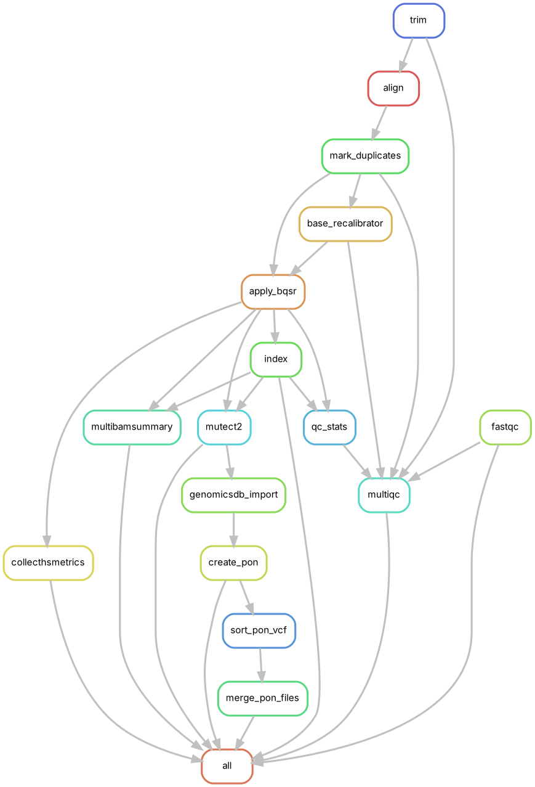

## 1. Panel of Normals (PoN) Pipeline

### Purpose

Creates a high-quality PoN VCF file from multiple normal BAM files. This PoN helps filter out recurrent sequencing artifacts and germline variants during somatic variant calling. The following DAG plot visualizes the PoN Snakemake workflow structure, highlighting rule dependencies and execution order:



### Configuration

Please refer to the sections below for detailed descriptions of:

- The main configuration file `config/config.yaml`, including reference files, target regions, and optional panel of normals.
- The sample list `config/samples_normal.yaml`, which should contain the list of normal samples.

### Run the PoN Pipeline

```bash
snakemake -s CreatePoN.smk --cores 8 
```

### PoN Outputs

The PoN pipeline generates the following output files, grouped by analysis step. These include quality control metrics, alignment files, and resources required to build a panel of normals for somatic variant calling with Mutect2.

---

#### Quality Control and Alignment

- `alignment/bams/{sample}.bam`  
  BAM file of aligned reads for each normal sample, generated using **BWA-MEM**, sorted and with duplicates marked.

- `alignment/bams/{sample}.bam.bai`  
  BAM index file for rapid access using **samtools index**.

- `alignment/qc/{sample}_fastqc.html`  
  Quality control report from **FastQC**, assessing read quality, GC bias, adapter contamination, etc.  
  [FastQC documentation](https://www.bioinformatics.babraham.ac.uk/projects/fastqc/)

- `alignment/qc/multiqc_report.html`  
  Summary report from **MultiQC**, aggregating FastQC results across all normal samples.  
  [MultiQC documentation](https://multiqc.info/)

---

#### Coverage and Hybrid Capture QC

- `variants/qc/CoverageSummary.txt`  
  Global coverage summary across target regions for all normal samples.

- `variants/qc/HsMetrics/{sample}_metrics.txt`  
  Hybrid selection metrics from **Picard CollectHsMetrics**, including bait coverage and on-target rates.  
  [Picard CollectHsMetrics](https://broadinstitute.github.io/picard/command-line-overview.html#CollectHsMetrics)

---

#### Somatic Variant Calling (for PoN generation)

- `variants/mutect2/{sample}.vcf.gz`  
  Per-sample variant calls from **Mutect2** in tumor-only mode, used for PoN construction.  
  [GATK Mutect2](https://gatk.broadinstitute.org/hc/en-us/articles/360037593851-Mutect2)

---

#### Panel of Normals Output

- `variants/mutect2/custom_pon.vcf.gz`  
  Raw panel of normals VCF file generated from all normal sample calls.

- `merged_pon.vcf.gz`  
  Final merged panel of normals VCF file, used as an input for somatic variant calling in tumor samples.

---